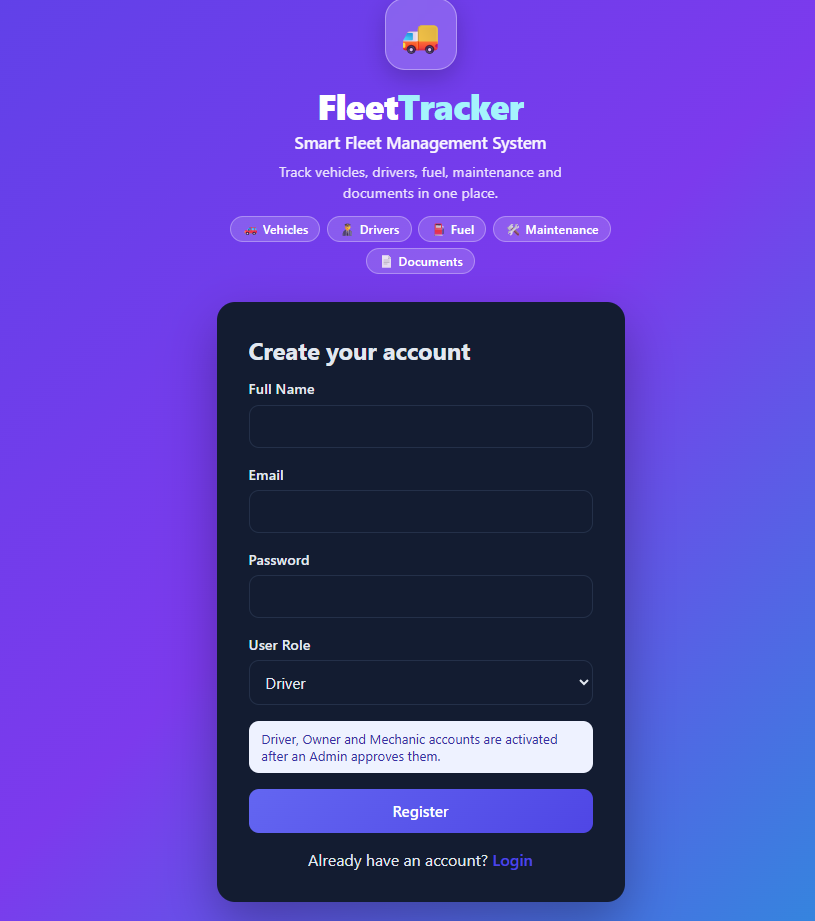
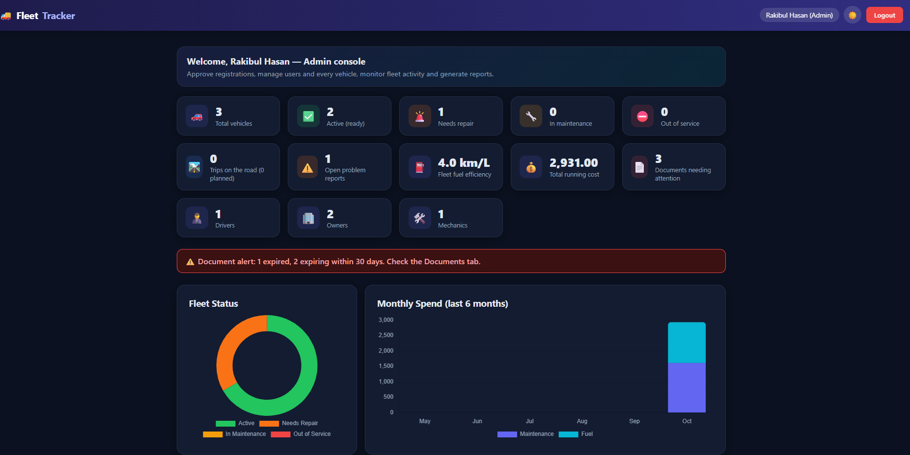
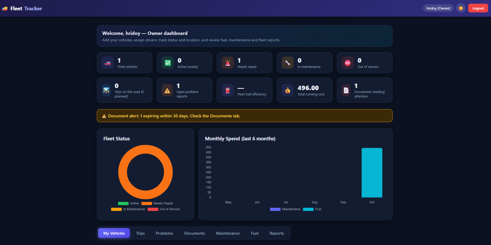
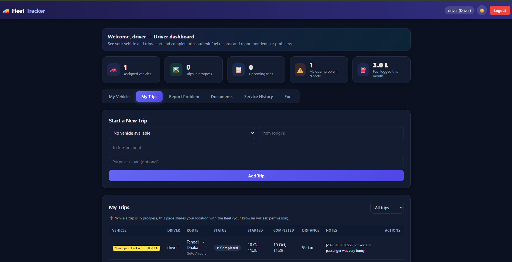
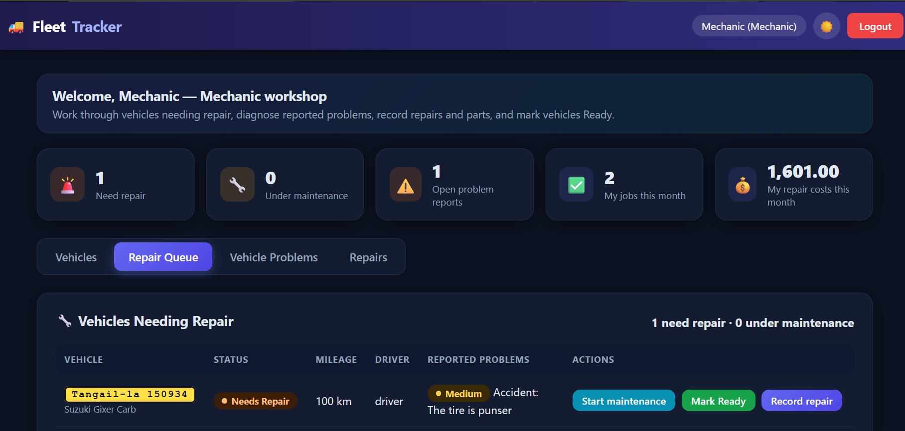

# 🚚 Fleet Tracker

A role-based fleet management web application. Admins, Owners, Drivers and Mechanics each get their own workspace for trips, fuel records, problem reports, repairs and cost reports.

**Live demo:** https://fleet-tracker-five-swart.vercel.app/

---

## Features

- **Registration approval:** new Driver, Owner and Mechanic accounts stay *Pending* until an Admin approves them
- **Role-based dashboards:** each role sees only its own tabs, data and actions
- **Vehicle management:** add, edit and assign drivers, with status and last known location
- **Trip management:** create, start, delay, complete and cancel trips with odometer and distance
- **Problem reporting:** drivers report accidents or faults, and the vehicle is marked *Needs Repair*
- **Repair tracking:** repair queue, replaced parts, labor and cost, mark vehicles *Ready* or *Under Maintenance*
- **Fuel and documents:** fuel records with costs, and document expiry alerts
- **Reports:** cost per vehicle for a date range, with CSV export and print
- **Activity log:** Admin audit trail of who did what and when
- **Light and dark theme**

## User roles

| Capability | Admin | Owner | Driver | Mechanic |
|---|:-:|:-:|:-:|:-:|
| Approve or reject registrations, manage users | ✅ | | | |
| Manage vehicles | all | own | | |
| Assign drivers to vehicles | ✅ | ✅ | | |
| View vehicle status and location | ✅ | ✅ | own | ✅ |
| Create and cancel trips | ✅ | ✅ | own | |
| Start, complete and delay trips | ✅ | | own | |
| Submit fuel records | ✅ | | ✅ | |
| View fuel costs | ✅ | ✅ | | |
| Report accident or problem | ✅ | ✅ | ✅ | |
| Diagnose problems, repair queue | ✅ | | | ✅ |
| Record repairs, parts and costs | ✅ | | | ✅ |
| Fleet reports | ✅ | ✅ | | |
| Activity log | ✅ | | | |

## Vehicle status flow

```
Active (Ready) → driver reports a problem → Needs Repair
→ mechanic starts work → In Maintenance → mechanic marks Ready → Active
```

Trips can only be created or started on vehicles with *Active* status.

## Tech stack

| Layer | Technology |
|---|---|
| Frontend | HTML, CSS, vanilla JavaScript, Chart.js |
| Backend | Node.js, Express |
| Database | MongoDB with Mongoose |
| Authentication | JWT, bcryptjs |
| Hosting | Vercel (serverless functions) |

## Project structure

```
Fleet Tracker/
├── api/
│   └── index.js        # Express app: routes, auth, role rules
├── models/             # Mongoose models
│   ├── User.js  Vehicle.js  Trip.js  Incident.js
│   ├── Maintenance.js  Fuel.js  Document.js  Activity.js
│   └── Driver.js  Owner.js  Mechanic.js
├── public/
│   ├── index.html  login.html  dashboard.html
│   ├── css/style.css
│   └── js/app.js       # Dashboard logic
├── vercel.json
└── package.json
```

## Getting started

### Prerequisites
- Node.js 18 or later
- A MongoDB database (for example a free MongoDB Atlas cluster)
- [Vercel CLI](https://vercel.com/docs/cli) for running locally

### Installation

```bash
https://github.com/rakibulhasan02/Fleet-Tracker.git
cd Fleet-Tracker
npm install
```

### Environment variables

Create a `.env` file (or set these in Vercel project settings):

| Variable | Description |
|---|---|
| `MONGODB_URI` | MongoDB connection string (required) |
| `JWT_SECRET` | Long random string used to sign login tokens |
| `ADMIN_SIGNUP_CODE` | Secret code needed to register an extra Admin |

### Run locally

```bash
vercel dev
```

Then open the URL shown in the terminal.

### Deploy

Import the repository into Vercel, add the environment variables, and deploy. `vercel.json` already routes `/api/*` to the Express app and serves `public/` as static files.

## First use

1. Open the site and register. **The first account ever created becomes Admin** and is approved automatically.
2. Other users register as Driver, Owner or Mechanic, then wait for approval.
3. Log in as Admin, open the **Users** tab and approve them.

## Screenshots

| Login / Register | Admin |
|---|---|
|  |  |
| **Owner** | **Driver** |
|  |  |
| **Mechanic** | |
|  | |

*Add your screenshots to a `screenshots/` folder with these names.*

## Future improvements

- Live GPS map of vehicles
- Email or SMS notifications for approvals, document expiry and problems
- Mobile app for drivers
- Maintenance reminders by mileage
- Photo uploads for accidents and receipts
- Fuel efficiency analytics and driver scoring

## Author

**Md Rakibul Hasan** · Web Application Development / ICT / MBSTU · rakibul.ict02@gmail.com


